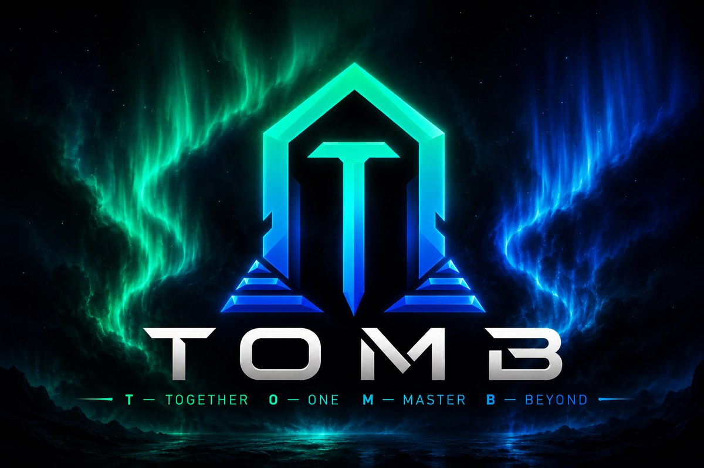

  

<h1 align="center">TOMB Guild Platform</h1>

  <em>Sign in with Battle.net. See the guild, and everyone in it.</em>

---

**<https://tombguild.com>**

The TOMB guild site. Sign in with your Battle.net account and your characters
are already there — pulled straight from Blizzard, nothing to type in and
nothing to keep up to date by hand.

It is for TOMB members. Membership is checked against the guild your characters
are actually in, so there is no list for anyone to maintain and nobody to ask
for access.

## Signing in

Click **Sign in with Battle.net**. Blizzard's own page asks whether you want to
let the site see your World of Warcraft profile; approve it and you land back
here, signed in.

You never type a password into this site. It never sees one, never stores one,
and cannot change anything on your account — it can only read your characters.
If you ever want to cut it off, revoke it in your Battle.net account settings
and it loses access immediately.

You stay signed in for about a day, then sign in again the same way.

## The guild

Signing in lands you here: the whole TOMB roster down the left, guild master at
the top and trainees at the bottom, alphabetical within each rank. It is the
page the **TOMB** link in the corner always goes back to.

There is a search box above the list. Start typing a name and the browser
suggests matches from the roster; pick one and you are on that character's
Armory view. Typing a whole name and pressing enter does the same. Two
characters with the same name on different realms show as `Cwds (Elune)` and
`Cwds (Illidan)`, so the pick is never in doubt.

The rows work exactly like the ones on My Characters:

- **Hover a name** — or tab to it — and that member's card opens.
- **Click the name** in the card and the main panel becomes their Armory view:
  Blizzard's render of them in their current gear, their spec, level and item
  level, and every equipped slot with its tooltip, gems and set pieces.

The card is the same one your own characters get — class, specialisation,
level, average item level, when they last played, their Mythic+ rating and how
far they are into each current raid — so you can size up a guildmate without
opening them.

It is the same panel your own characters get, because it is literally the same
page component — so anything that improves one improves the other.

Until you click someone, the panel shows the guild at a glance: how many
characters are on the roster, how many are at max level, and the breakdown by
class as a bar chart — with, under each class, how many of them are tanks,
healers and DPS by their current specialisation. Beside it are three leaderboards — top item
level, top Mythic+ rating, and most raid bosses down (mythic kills first, then
heroic, then normal) — each naming the top ten, with every name a link to that
character's Armory view. All of it is counted from the roster the site already
holds, so it costs nothing extra to show.

A few things worth knowing:

- **Only guild members can be opened.** The roster is the list of who this page
  will look up; a link to anyone else is refused rather than fetched.
- **Ranks show as numbers until they are named.** Guild ranks have no names in
  Blizzard's data, only positions, so the site has to be told them. Until it is,
  the headings read "Rank 1", "Rank 2" and the page says why.
- **The roster refreshes itself about once an hour.** Each member's card needs
  their own profile from Blizzard, and with a couple of hundred characters on
  the roster that is too many calls to make every time someone opens the page.
  So the whole roster is refreshed in the background and you always see the
  last one, instantly. A member's Armory view, when you click them, is live.
- **A card missing its item level or last played** means Blizzard would not
  return that character's profile at the last refresh — usually a recent
  rename or transfer. The roster row itself is still right.

## My Characters

Every character on your account is listed down the left, most recently played
first.

- **Hover a character** — or tab to it with the keyboard — and its card opens.
- **Click the name** in that card and the main panel switches to it.

The main panel is the Armory-style view: your character as Blizzard renders it,
in the gear it is wearing right now, alongside its realm and guild, class and
specialisation, level and item level, this season's Mythic+ rating and raid
progress ("8/8 H · 3/8 M"), and every equipped slot with its own item level and
quality colour.

The Mythic+ rating is the one the game shows, straight from Blizzard. It is
close to a Raider.IO score but not the same number — Raider.IO computes its
own — so do not be surprised if the two differ by a little.

It opens on whatever you played last, so the common case takes no clicks at all.

A few things worth knowing:

- **It is always live.** Nothing is cached. Every time you open the page it asks
  Blizzard again, so what you see is what Blizzard knows now. Log out of the
  game in new gear and it is here on your next refresh.
- **Characters you have deleted or transferred away may still be listed by
  Blizzard.** Those are skipped quietly rather than shown as errors.
- **Not every character has a render.** If Blizzard has never generated an image
  for one, the panel says so and shows everything else as normal.

## Calendar

The guild's schedule, under **Calendar** in the navigation: what is happening
and when, by day. All times on the site — the calendar, when a character last
played, the logs — are Eastern, the zone the guild runs on. It follows
daylight saving on its own, so it reads EDT in summer and EST in winter.

The guild master and officers can add, change and remove events; everyone else
reads. Every change is recorded in the Logs: who, when, and what changed.

## Logs (guild master and officers)

Officers have a **Logs** entry in the navigation that nobody else sees or can
open. It is the audit trail: who signed in and out, and every change to the
calendar — what was changed, by whom, and when — newest first, filterable by
kind. Nothing in it can be edited or removed, by anyone,
and the database is set up to refuse it even if somebody tried.

## Coming to TOMB

None of this is built yet — it is what the site is being pointed at. There is a
**Coming Soon** page in the top navigation with the same list.

**Guild calendar.** Raid nights, key pushes and transmog runs in one place, with
sign-ups that survive being scrolled past in Discord.

**Ask TOMB Bot** *(AI)*. An agent that knows *this* guild. Ask what is running
this week, who normally tanks, what the loot rules are, or for advice on a spec
you have not touched in a year — answered from the guild's own data rather than
from World of Warcraft in general.

**Combat log analysis** *(AI)*. Compare your logs against the top performers of
your class and spec. Not a number and a ranking, but the actual differences,
ordered by what each one is costing you, with a suggested fix for each.

**Gear analysis** *(AI)*. Compare your gear to the top performers and get the
path of least resistance to your next upgrades: which slot is holding you back
most, where the piece comes from, and how much effort it is — prioritised, so
your crests, catalyst charges and vault picks go where they matter rather than
where you happened to look first.

No dates. When something lands it will appear in the navigation.

## Something not right?

**"TOMB members only" but you are in TOMB.** Membership is read from Blizzard,
so a character that joined very recently can take a little while to show up
there. If it persists, say so in Discord — it is worth looking at rather than
waiting out.

**A character missing, or the wrong gear.** The site shows exactly what Blizzard
returns, and Blizzard updates a character after you log out of the game. The
usual fix is to log out and refresh.

---

Built and run by the guild. How it works, how it is deployed and how to add to
it are in [docs/README.md](docs/README.md).
